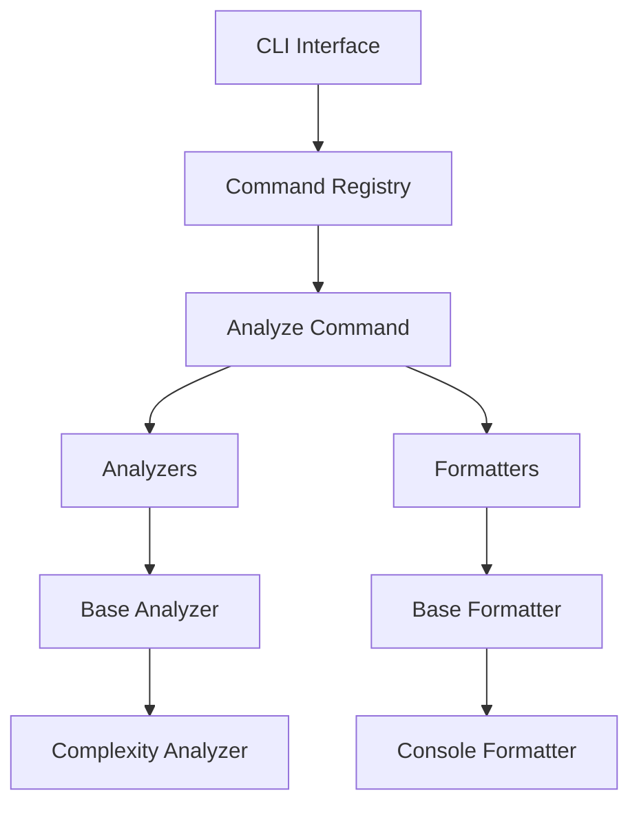
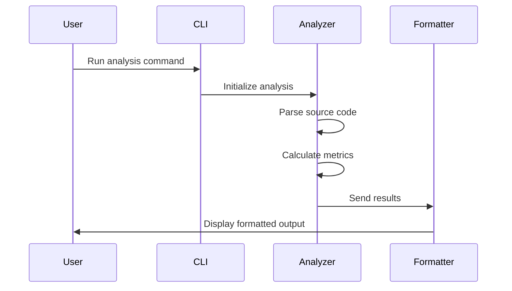
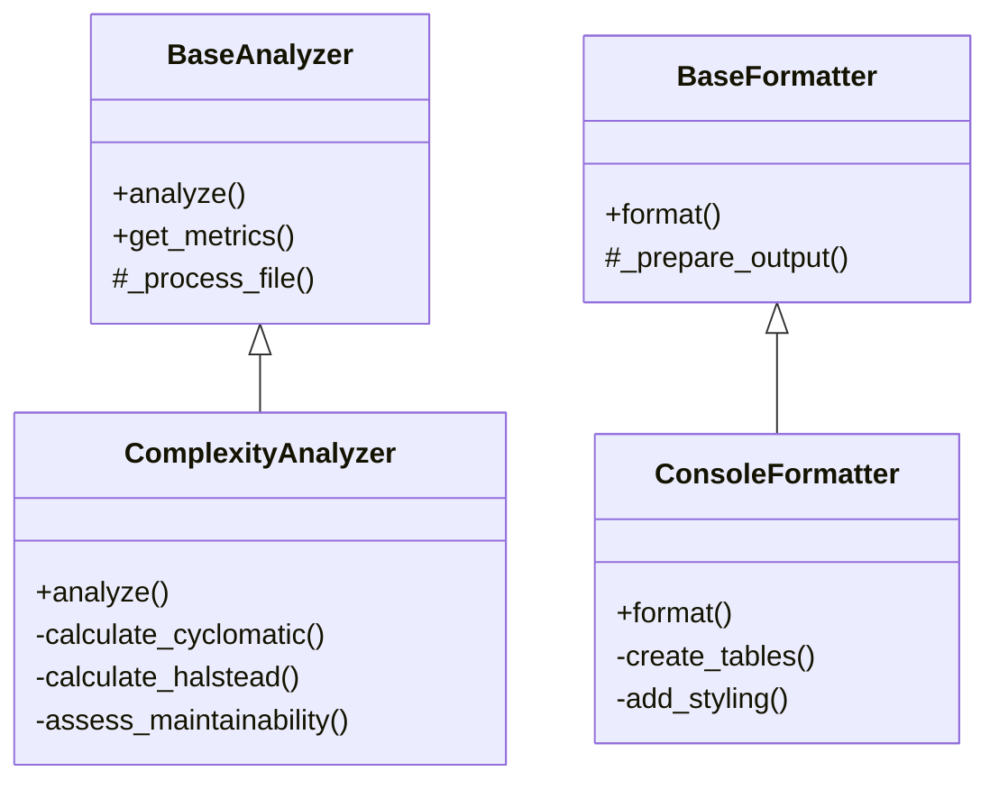
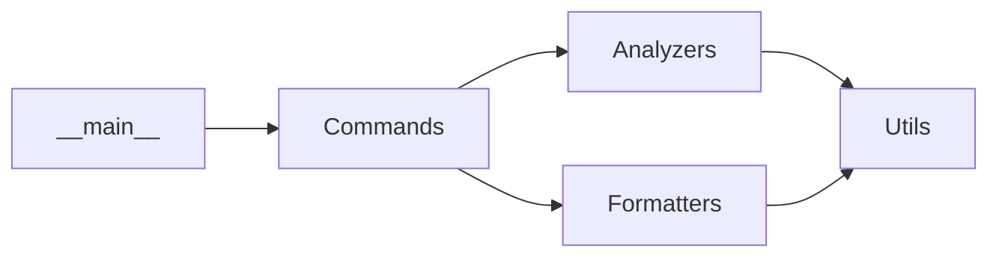
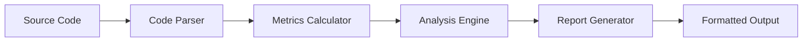

# Code Analyzer Architecture

## High-Level Component Diagram

```mermaid
graph TB
    CLI[CLI Interface] --> CommandRegistry[Command Registry]
    CommandRegistry --> AnalyzeCommand[Analyze Command]
    AnalyzeCommand --> Analyzers[Analyzers]
    Analyzers --> BaseAnalyzer[Base Analyzer]
    BaseAnalyzer --> ComplexityAnalyzer[Complexity Analyzer]
    AnalyzeCommand --> Formatters[Formatters]
    Formatters --> BaseFormatter[Base Formatter]
    BaseFormatter --> ConsoleFormatter[Console Formatter]
```

## Data Flow Diagram

```mermaid
sequenceDiagram
    participant User
    participant CLI
    participant Analyzer
    participant Formatter
    
    User->>CLI: Run analysis command
    CLI->>Analyzer: Initialize analysis
    Analyzer->>Analyzer: Parse source code
    Analyzer->>Analyzer: Calculate metrics
    Analyzer->>Formatter: Send results
    Formatter->>User: Display formatted output
```

## Class Hierarchy

```mermaid
classDiagram
    class BaseAnalyzer {
        +analyze()
        +get_metrics()
        #_process_file()
    }
    class ComplexityAnalyzer {
        +analyze()
        -calculate_cyclomatic()
        -calculate_halstead()
        -assess_maintainability()
    }
    class BaseFormatter {
        +format()
        #_prepare_output()
    }
    class ConsoleFormatter {
        +format()
        -create_tables()
        -add_styling()
    }
    BaseAnalyzer <|-- ComplexityAnalyzer
    BaseFormatter <|-- ConsoleFormatter
```

## Module Dependencies

```mermaid
graph LR
    Main[__main__] --> Commands
    Commands --> Analyzers
    Commands --> Formatters
    Analyzers --> Utils
    Formatters --> Utils
```

## Analysis Pipeline

```mermaid
graph LR
    Input[Source Code] --> Parser[Code Parser]
    Parser --> Metrics[Metrics Calculator]
    Metrics --> Analysis[Analysis Engine]
    Analysis --> Report[Report Generator]
    Report --> Output[Formatted Output]
``` 